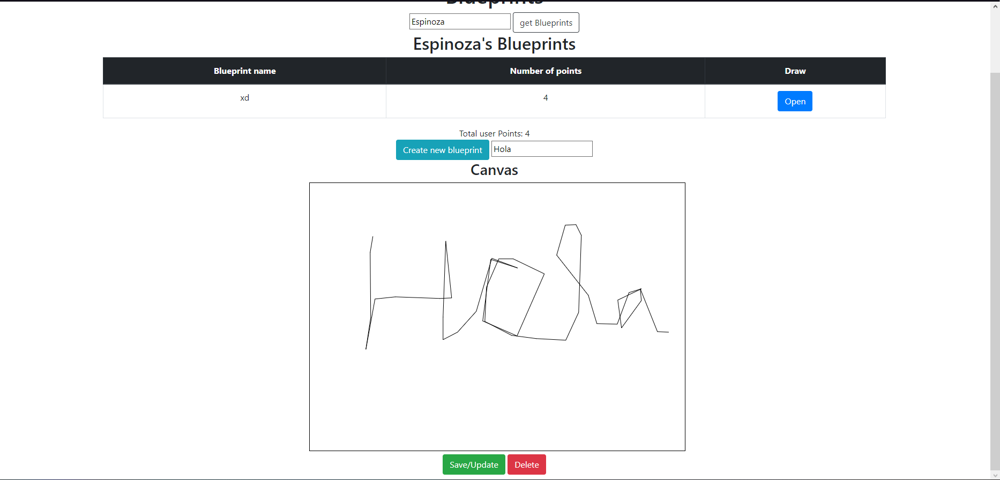
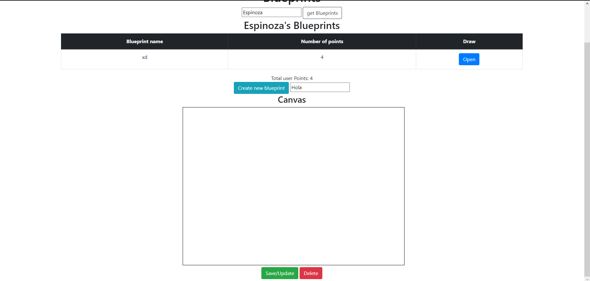

# lab07ARSW
## Juan Pablo Espinosa
## Juan Andrés Pico
Agregue al canvas de la página un manejador de eventos que permita capturar los 'clicks' realizados, bien sea a través del mouse, o a través de una pantalla táctil. Para esto, tenga en cuenta este ejemplo de uso de los eventos de tipo 'PointerEvent' (aún no soportado por todos los navegadores) para este fin. Recuerde que a diferencia del ejemplo anterior (donde el código JS está incrustado en la vista), se espera tener la inicialización de los manejadores de eventos correctamente modularizado, tal como se muestra en este codepen.

PUT: debemos consultar un autor, después de obtener sus planos, abrimos alguno y cuando mostremos el plano en el canvas procedemos a pintar el reemplazo de este plano, posteriormente para guardar usamos el botón save/update  a continuación se actualizará el plano

Para verificar volvemos a obtener los planos del autor y vemos como cambia al plano que hemos dibujado

POST: para crear un plano primero consultamos un autor, después de esto ingresamos un nombre para el plano y a continuación hacemos el dibujo del plano, finalmente usamos el botón create blueprint y creamos el plano; nuevamente verificamos  el plano consultando por autor

DELETE: consultamos un autor, damos open a un plano, y el plano seleccionado se borrará con el botón delete, borrando el canvas y el recurso

